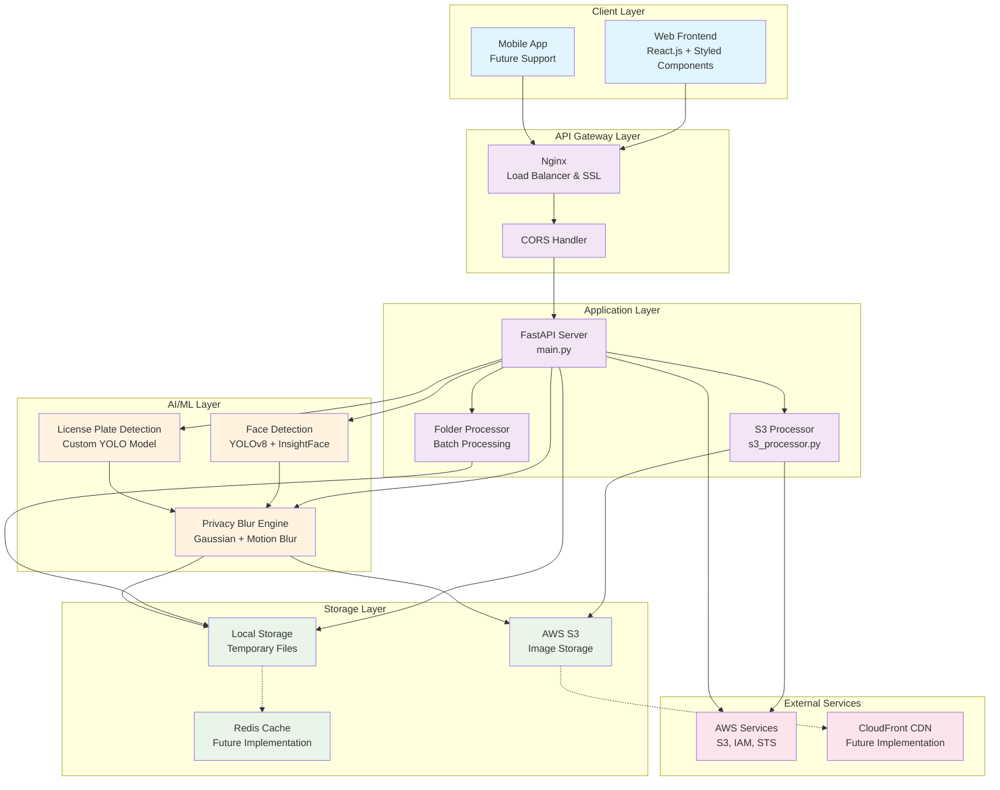
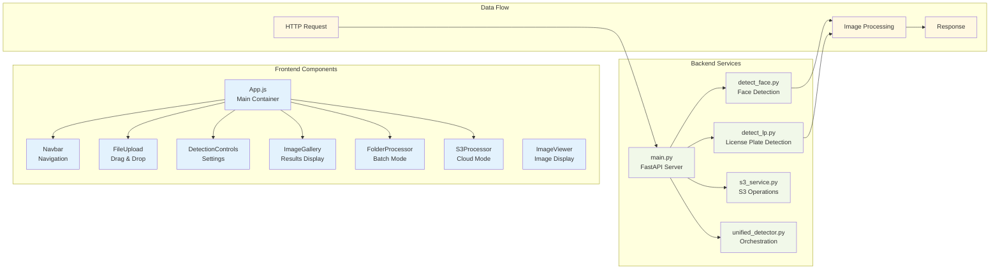
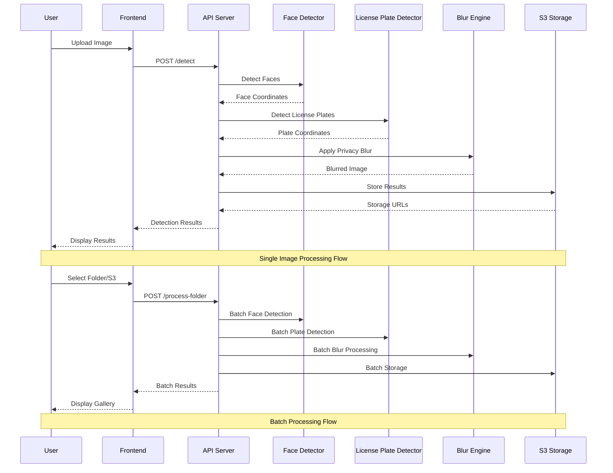
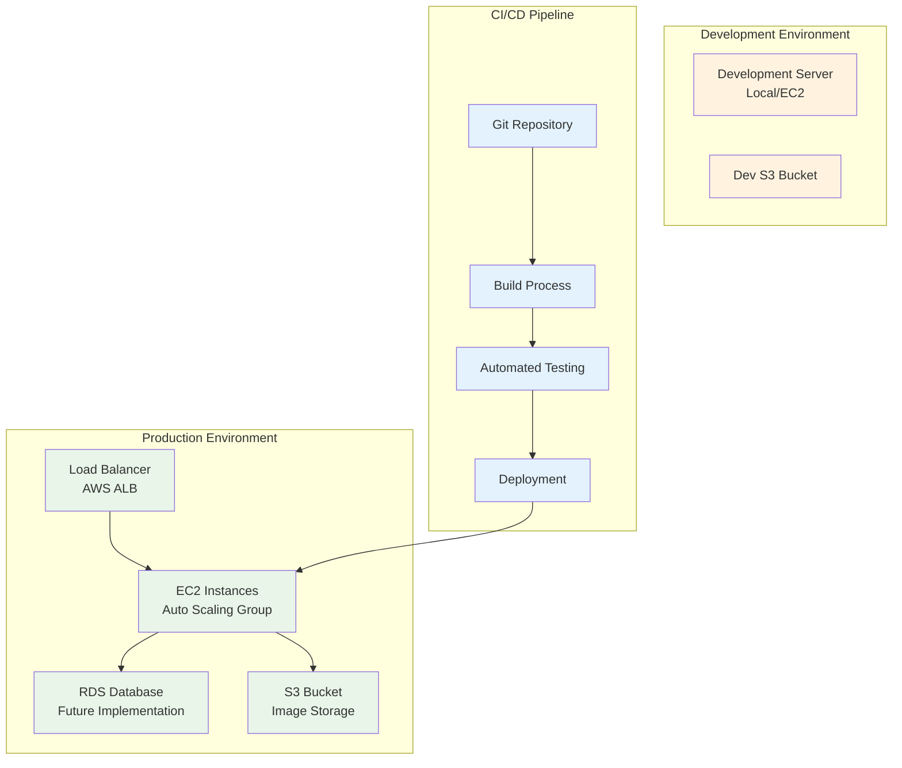

# Iden-Hide AI Anonymization Engine - System Architecture

## ⚠️ Security Notice

**This is a rapid development prototype built in 24 hours for a hackathon. Security has not been implemented as the primary focus was on core functionality and AI detection capabilities. The next critical step is implementing comprehensive security measures including:**

- Authentication and authorization
- Input validation and sanitization
- Rate limiting and DDoS protection
- Data encryption at rest and in transit
- Secure credential management
- API key validation
- Request logging and monitoring

**Do not use this in production without implementing proper security measures.**

## Overview

Iden-Hide is a comprehensive AI-powered anonymization engine that detects and blurs faces and license plates in images while preserving image context. The system is built with a modern microservices architecture supporting multiple processing modes.

## System Architecture Diagram

## Component Architecture

## Data Flow Architecture

## Technology Stack

### Frontend
- **Framework**: React.js 18.2.0
- **Styling**: Styled Components 6.1.0
- **File Handling**: React Dropzone 14.2.3
- **HTTP Client**: Axios 1.6.0
- **Notifications**: React Toastify 9.1.3
- **Build Tool**: Create React App

### Backend
- **Framework**: FastAPI (Python 3.13)
- **AI/ML**: 
  - YOLOv8 for object detection
  - InsightFace for face recognition
  - Custom license plate detection model
- **Image Processing**: OpenCV, PIL
- **Cloud Storage**: AWS S3 (boto3)
- **Async Processing**: asyncio, multiprocessing

### Infrastructure
- **Containerization**: Docker (planned)
- **Cloud Platform**: AWS
- **Storage**: AWS S3
- **CDN**: CloudFront (planned)
- **Monitoring**: CloudWatch (planned)

## Security Architecture

```mermaid
graph TB
    subgraph "Security Layers"
        SSL[SSL/TLS Encryption]
        CORS[CORS Protection]
        AUTH[Authentication<br/>Future: JWT]
        RBAC[Role-Based Access<br/>Future Implementation]
    end

    subgraph "Data Protection"
        ENCRYPT[Data Encryption<br/>At Rest & In Transit]
        PRIVACY[Privacy Blur<br/>AI-Powered]
        AUDIT[Audit Logging<br/>Future Implementation]
    end

    subgraph "API Security"
        RATE[Rate Limiting<br/>Future Implementation]
        VALID[Input Validation]
        SANITIZE[Data Sanitization]
    end

    SSL --> CORS
    CORS --> AUTH
    AUTH --> RBAC

    ENCRYPT --> PRIVACY
    PRIVACY --> AUDIT

    RATE --> VALID
    VALID --> SANITIZE

    classDef security fill:#ffebee
    classDef data fill:#e8f5e8
    classDef api fill:#e3f2fd

    class SSL,CORS,AUTH,RBAC security
    class ENCRYPT,PRIVACY,AUDIT data
    class RATE,VALID,SANITIZE api
```

## Deployment Architecture

## Performance Characteristics

### Scalability
- **Horizontal Scaling**: Auto-scaling EC2 instances
- **Async Processing**: Non-blocking I/O for file operations
- **Batch Processing**: Efficient multi-image processing
- **Caching**: Redis for frequently accessed data (planned)

### Performance Metrics
- **Image Processing**: ~2-5 seconds per image
- **Batch Processing**: Parallel processing with configurable workers
- **API Response Time**: <200ms for metadata, <5s for processing
- **Throughput**: 10-50 images/minute (depending on complexity)

### Resource Requirements
- **CPU**: 2-4 cores minimum for AI processing
- **RAM**: 8-16GB for model loading and processing
- **Storage**: 100GB+ for models and temporary files
- **GPU**: Optional, for faster AI processing

## Security Implementation Roadmap

### Phase 1: Critical Security (Next Priority)
- **Authentication**: JWT-based authentication system
- **Authorization**: Role-based access control (RBAC)
- **Input Validation**: Comprehensive request validation and sanitization
- **Rate Limiting**: API rate limiting and DDoS protection
- **HTTPS**: SSL/TLS encryption for all communications

### Phase 2: Data Security
- **Data Encryption**: Encrypt data at rest and in transit
- **Secure Storage**: Encrypted S3 buckets with proper IAM policies
- **Credential Management**: AWS Secrets Manager or HashiCorp Vault
- **API Keys**: Secure API key generation and validation
- **Audit Logging**: Comprehensive security event logging

### Phase 3: Advanced Security
- **Multi-factor Authentication**: 2FA/MFA support
- **Security Headers**: CORS, CSP, HSTS implementation
- **Vulnerability Scanning**: Regular security assessments
- **Penetration Testing**: Third-party security testing
- **Compliance**: SOC 2, ISO 27001 compliance features

## Future Enhancements

### Planned Features
- **Real-time Processing**: WebSocket support for live video
- **Advanced AI Models**: More sophisticated detection algorithms
- **Multi-tenant Support**: User authentication and data isolation
- **API Rate Limiting**: Protection against abuse
- **Monitoring Dashboard**: Real-time system metrics
- **Mobile App**: Native iOS/Android applications

### Technical Debt
- **Error Handling**: More comprehensive error management
- **Logging**: Structured logging with correlation IDs
- **Testing**: Increased test coverage (unit, integration, e2e)
- **Documentation**: API documentation with OpenAPI/Swagger
- **Security**: Enhanced authentication and authorization

---

*This architecture document is maintained alongside the codebase and reflects the current state of the Iden-Hide AI Anonymization Engine.*
